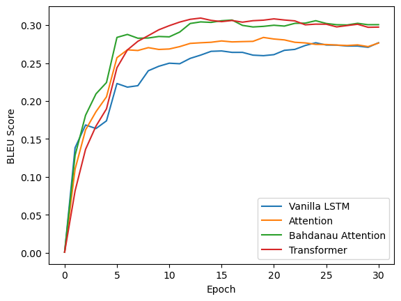

# Image Captioning

Pytorch code for Image captioning using ViT Encoder and the following Decoders:  (i) Vanilla LSTM, (ii) Attention LSTM, (iii) Bahdanau Attention LSTM, and (iv) Transformers. (ii) and (iii) are used for explainablity

---

## Python Environment Setup

Ensure the following is installed in your python environment:

- Pytorch - required for standard nn llibraries and automatic backpropagation
- Torchvision - required for libraries related to computer vision
- Matploitlib - required for plotting
- Transformers (Huggingface): Required for Pretrained Vision Transformers
- NLTK - required for calculating BLEU score

## Dataset and preparation

After cloning, ensure to create the folders `data`, `models`, and `temp` by running:
```
$ mkdir data models temp
```
Then download the and extract the dataset [Kaggle - Flickr8k](https://www.kaggle.com/datasets/adityajn105/flickr8k) and paste the folder `flickr8k` inside the `data` folder.

Preprocess the dataset by running:
```
$ python helpers/split_data.py
```
This will create two auxiliary files `train_captions.pkl` and `val_captions.pkl` in the `data/flickr8k` folder.

## Vanilla LSTM Captioning

Execute the following to run the Vanilla ViT LSTM model:
```
$ python 01_caption_lstm.py train
```
This will train the model on the training set and save the trained model in `models/vit_lstm_encoder.pth`, `models/vit_lstm_decoder.pth` and the validation scores in `temp/vit_lstm_val_scores.npy`.

Execute the following to test the model on the validation set:
```
$ python 01_caption_lstm.py
```
This will create image.png in the `images` folder and display the predicted captions along with the ground truth captions.

## Dot Production Attention LSTM Captioning

Execute the following to run the Attention ViT LSTM model:
```
$ python 02_caption_attention.py train
```
This will train the model on the training set and save the trained model in `models/vit_lstm_attn_encoder.pth`, `models/vit_lstm_attn_decoder.pth` and the validation scores in `temp/vit_lstm_attn_val_scores.npy`.

Execute the following to test the model on the validation set:
```
$ python 02_caption_attention.py
```
This will create image.png in the `images` folder and display the predicted captions along with the ground truth captions along with `image_exp.png` in the `images` folder that shows the attentions map for each word.

## Bahdanau Attention LSTM Captioning

Execute the following to run the Bahdanau Attention ViT LSTM model:
```
$ python 03_caption_attnetion_bahdanau.py train
```
This will train the model on the training set and save the trained model in `models/vit_lstm_attnb_encoder.pth`, `models/vit_lstm_attnb_decoder.pth` and the validation scores in `temp/vit_lstm_attnb_val_scores.npy`.

Execute the following to test the model on the validation set:
```
$ python 03_caption_attnetion_bahdanau.py
```
This will create image.png in the `images` folder and display the predicted captions along with the ground truth captions along with `image_exp.png` in the `images` folder that shows the attentions map for each word.

## Transformers Captioning

Execute the following to run the ViT Transformer captioning model:
```
$ python 04_caption_transformer.py train
```
This will train the model on the training set and save the trained model in `models/vit_tf_decoder.pth` and the validation scores in `temp/vit_tf_val_scores.npy`.

## Plots

Execute the following to plot the validation scores:
```
$ python helpers/plot.py
```
The plot will be saved at `images/plot.png`. The plot should look something as follows:


